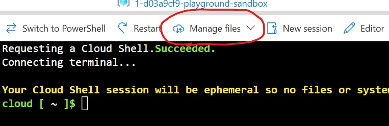

# Scenario Setup

These instructions explain how to setup the scenario for today's exercise.

First you'll need to setup an ACG Cloud Sandbox for Azure (as we have done on previous workshops).

Once the sandbox is setup, login to the Azure portal and navigate to your resource group:


From here you'll want to create a **Bash** Cloud Shell. When the cloud shell is ready it should look something like this:



From here click the **Manage Files** to upload the following scripts:
* `setup_scenario.sh`
* All `*.tf` files in this folder (`main.tf`, `output.tf`, etc.)

You can then create your scenario resources by running:
```
bash ./setup_scenario.sh
```

You'll then be prompted to provide your resource group name and a prefix.

Once the deploy script has finished you should see a number of different resources starting with `order-processing` or `finance-package`.

The command above should list some Terraform outputs including:
* The order processing site URL (you'll want to look at this first)
* Database connection details

If you've got this far then congratulations! You've successfully setup the scenario and can proceed to [the main instructions here](../workshop_instructions.md)